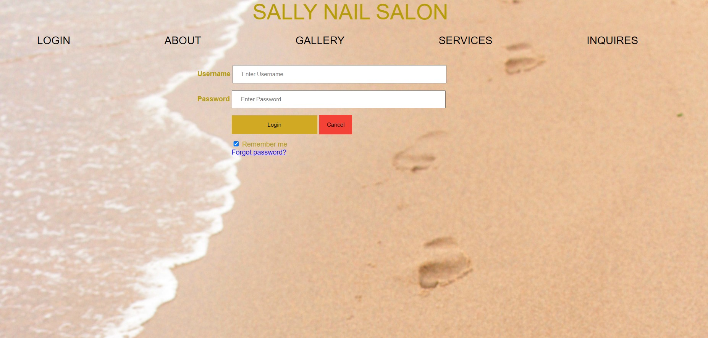
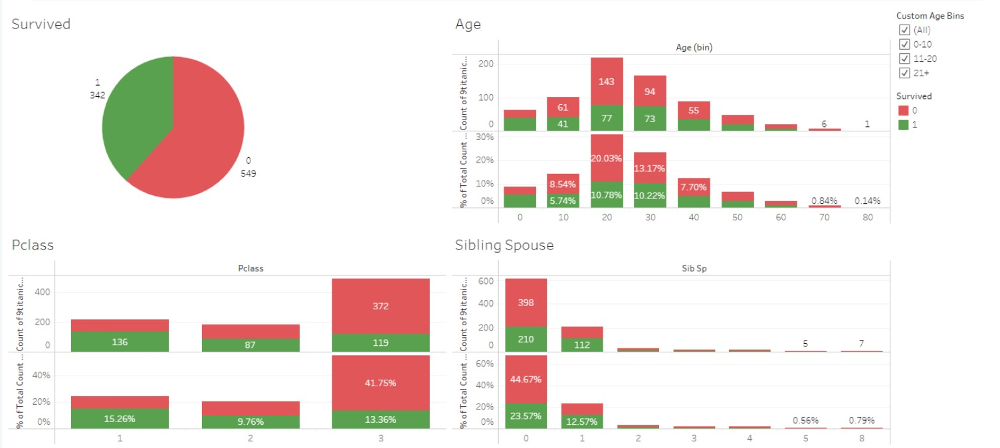

## Portfolio

---

### Projects 

[Nail Salon Website](sample_page.md)
 

---

[Company Sales Data](/sample_page)
 

---
[Company Sales Presentation](dashboard.jpg) 

---
[Geoprocessing Model](/pdf/sample_presentation.pdf)

---
[Global Sales]

---

### Category Name 2

- [Nail Salon Website](http://example.com/)
- [Data Analysis Covid Results](http://example.com/)
- [Tic-Tac-Toe Game](http://example.com/)
- [Data Warehouse Creation](http://example.com/)
- [Mason Lost and Found Web Application ](http://example.com/)
- [Graduation Web Application](http://example.com/)

---

---
<!-- Footer all rights reserved-->

Page template forked from <a href="https://github.com/evanca/quick-portfolio">evanca</a>

<!-- Remove above link if you don't want to attibute -->
